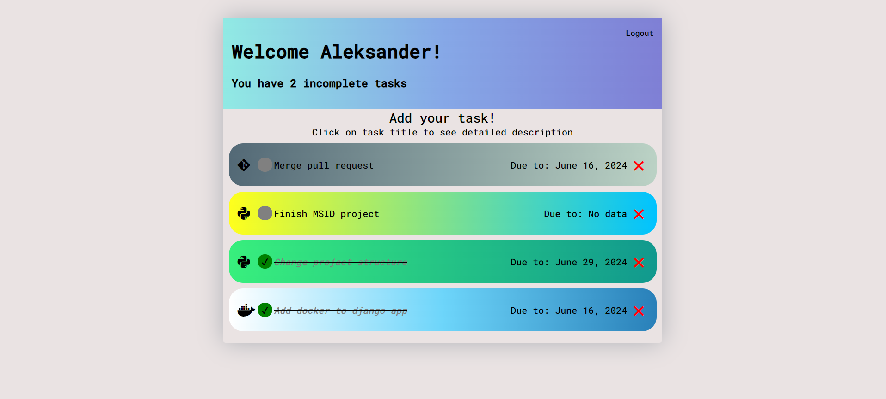

# Task manager for programmers 💻

## Overview
This project was made to make our life easier by organizing our tasks.

## Technologies used: Django, Docker

## Deployment

To deploy this project run

```bash
  git clone https://github.com/olekszczepanowski/scriptLanguagesProject.git
  cd scriptLanguagesProject
  docker compose up --build
```


## Demo



